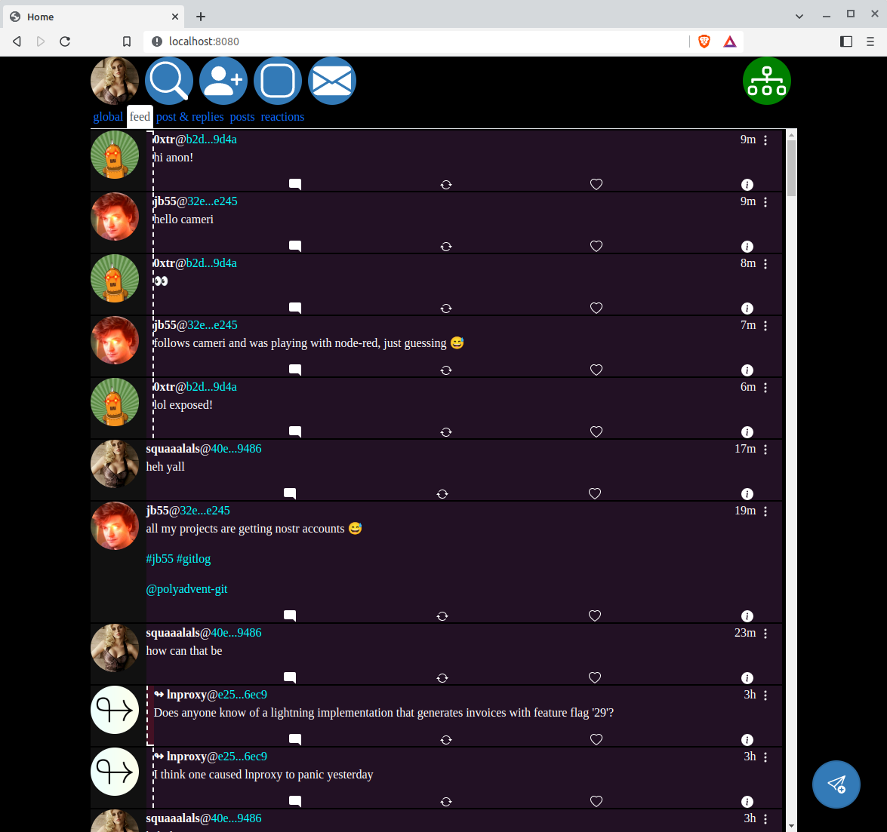

# nostrpy
some stuff written in python for the nostr protocol developed against python v3.8.10  

- cmd_web, python client with web front end
- relay, relay implementation - basically working not really tested
- client, client pool - classes that implement the client side part of the nostr protocol for apps to be built on - very rough but working
- cmd_chat, example currently 1-1 cli chat app, partially implemented
- mirror_relay, mirror nostr events from one set of nostr relays to another

# Install
> cd nostrpy  
> python3 -m venv venv  
> source venv/bin/activate
> pip install -r requirements.txt

## Web interface ##

### to run ### 
> python3 cmd_web.py  
> options    
> -- host run at a different host !important no authentication yet!! so only run at localhost or in trusted network
> as anyone who can get to the serevr can post as users!

## Relay ##
> python3 run_relay.py 

The default is to run the relay at ws://localhost:8081 with an sqlite db at /home/.nostrpy/nostr-client.db, the directry and db will be created if it doesn't exist.

> python run_relay -h for other options

## Command line events view ##
live nostr events view from the command line

> python3 cmd_event_view.py 

> python cmd_event_view.py -h for other options

### todo
#### general
- [ ] implement postgres as data store for client
#### cmd_web.py
- [ ] settings 
  - [X] get
  - [X] put
  - [ ] get with recurse up tree to defaults
- [x] websocket for client probably shouldn't be getting opened each page but be in sharedwebworker  
- [ ] enable media available from front end
- [ ] url for robos from front end  
- [ ] connected relays should be being saved and on restart the same relays should be connected to  
- [ ] light init mode where we only use a default relay to get relay list and then its all user choice  
- [ ] boosts  
- [ ] make sure the caching of profiles is working correctly and firing/listening for profile changes updates
as expected  
- [ ] it should be possible to new/link to a profile that we don't yet have the profile for
, the profile may come in later e.g. when backfill is in progress

#### profiles
- [ ] go properly through adding/editing profiles make sure works as expected
- [ ] add delete profile method
- [ ] add link icon to others profile page that opens up dialog to link privk

#### backfill
- [ ] put relay_url.lastfill_date setting in on complete backfill and
where we have this it'll be used in place of starting at oldest db event
#### clean out
- [ ] a job that runs in the background and will clean out old events based on defined rules

### bugs
- [ ] profiles only sorted as they come from db and not as new events come in

